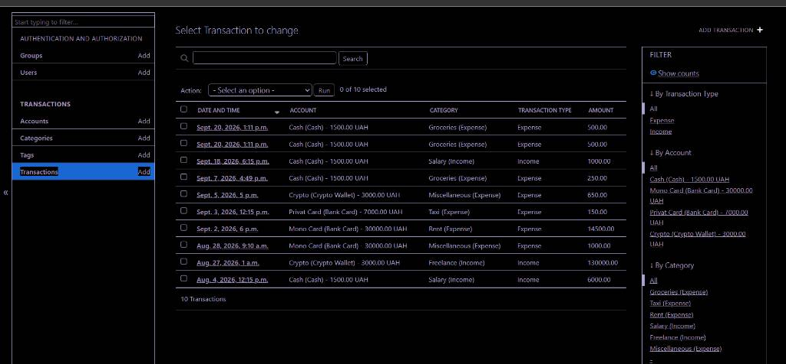

# CyberFinance - Personal Finance Tracker

A Django application for tracking personal finance, income, and expenses by categories with flexible transaction tagging. This project was developed as part of a Python course assignment.

##  Model Architecture
- **Account** — User financial accounts (Cash, Cards, Crypto) with choices-based types and calculated custom property validation.
- **Category** — Financial operation categories (Expenses / Income).
- **Tag** — Analytical tags for custom financial tracking (connected via ManyToManyField to Transactions).
- **Transaction** — The core model tracking money movements (connected via ForeignKey to Account and Category).

##  Technical Features
- Built with Django ORM for complex data filtration and aggregation logic.
- Fully customized professional Admin Dashboard featuring advanced list displays, filters, search utilities, and custom Admin Actions.
- Includes a standalone `queries.py` database test script showcasing native ORM queries and their RAW SQL representations.

##  How to Run Locally

1. Clone the repository and navigate to the project root:
   ```bash
   git clone <your_repository_link>
   cd cyber_finance
   ```

2. Create and activate a Python virtual environment:
   ```bash
   python -m venv .venv
   # For Windows:
   .venv\Scripts\activate
   # For Mac/Linux:
   source .venv/bin/activate
   ```

3. Install required dependencies:
   ```bash
   pip install django
   ```

4. Run database migrations:
   ```bash
   python manage.py migrate
   ```

5. Create an administrative user for dashboard access:
   ```bash
   python manage.py createsuperuser
   ```

6. Start the local development server:
   ```bash
   python manage.py runserver
   ```

##  Admin Dashboard Screenshot
